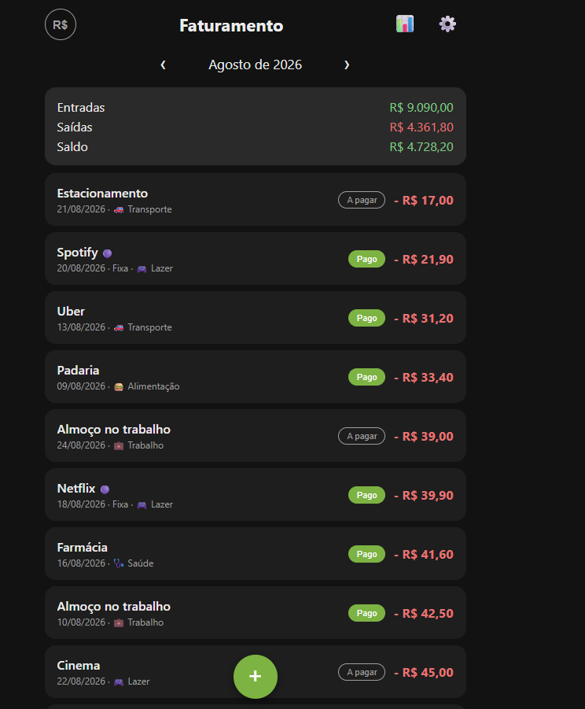
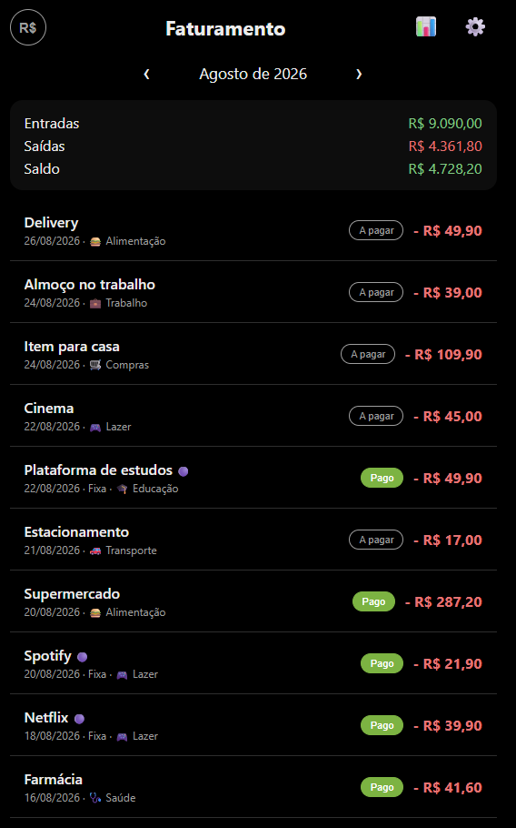
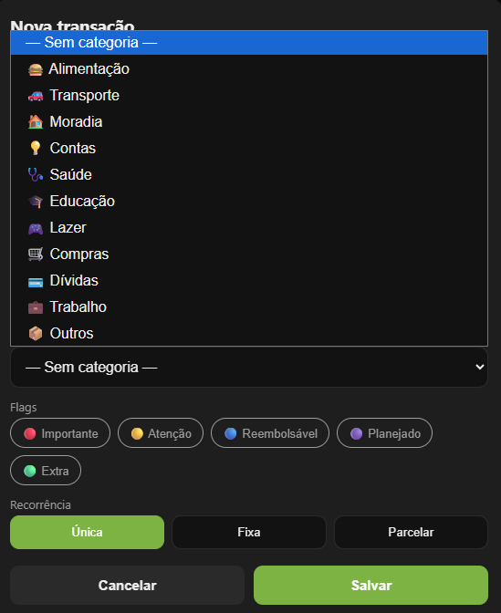
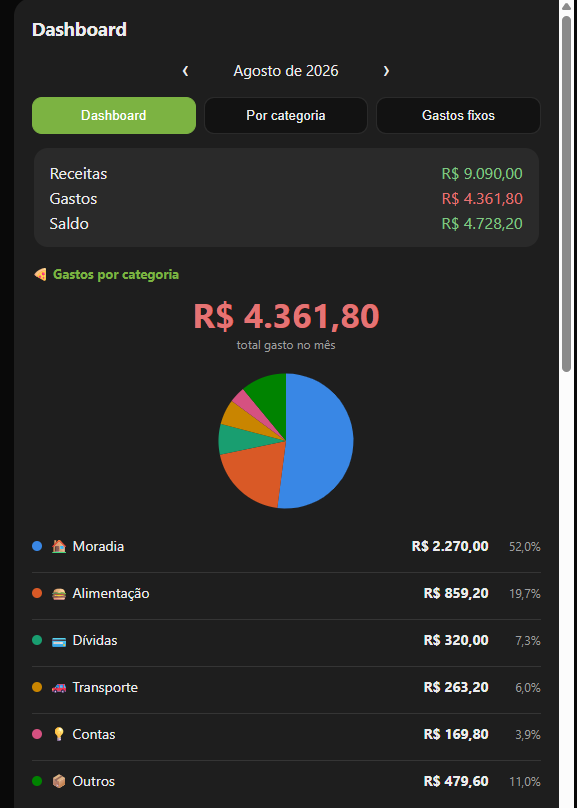
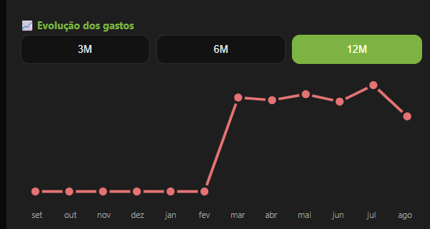
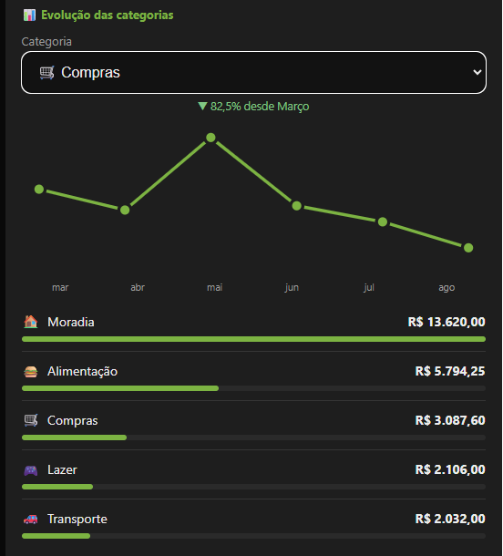
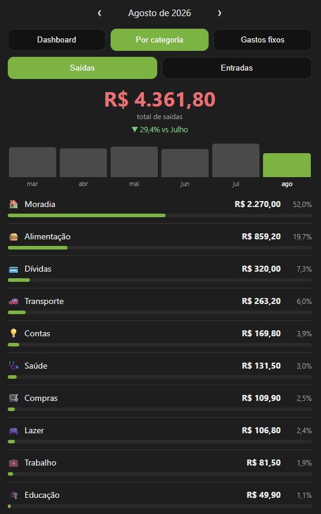
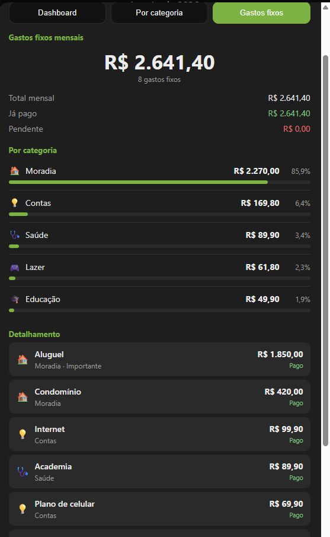
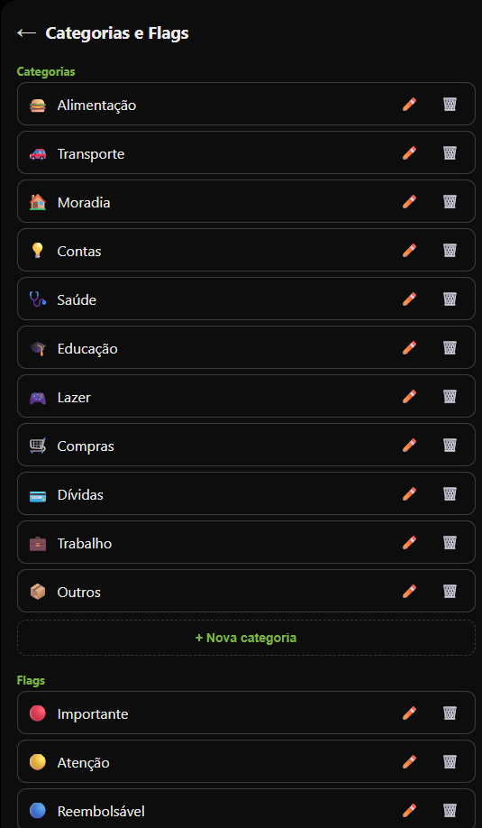

# Faturamento

Controle financeiro pessoal que roda no navegador e instala no celular como app. Sem cadastro, sem servidor, sem internet obrigatória — os dados ficam no seu aparelho.

## 🔗 Testar agora

**[https://matheus-emanoel-souza.github.io/FaturamentoAnalyticsWebApp/](https://matheus-emanoel-souza.github.io/FaturamentoAnalyticsWebApp/)**

Abre direto no navegador, não precisa instalar nada para experimentar.

**Para usar como app no celular:**

- **iPhone** — abra o link no **Safari** → botão **Compartilhar** → **Adicionar à Tela de Início**
- **Android** — abra no **Chrome** → aparece o convite "Instalar", ou use o menu ⋮ → **Instalar app**

Depois de instalado, abre em tela cheia e funciona **offline**.

> Os dados ficam salvos no navegador do seu aparelho. Nada é enviado para lugar nenhum — e nada é sincronizado entre dispositivos automaticamente. Use **Configurações → Backup completo** de vez em quando.

---

## 📸 Screenshots

*(dados fictícios, gerados só para ilustrar as telas)*

<table>
<tr>
<td width="33%">

**Tela principal**
Resumo do mês — entradas, saídas, saldo — e a lista de lançamentos com status de pago/pendente.



</td>
<td width="33%">

**Pago / pendente**
Cada lançamento pode ser marcado como pago ou a pagar, pra acompanhar o que ainda falta no mês.



</td>
<td width="33%">

**Nova transação**
Categoria, flags e recorrência (única, fixa ou parcelada) na hora de lançar.



</td>
</tr>
<tr>
<td width="33%">

**Dashboard — por categoria**
Pizza dos gastos do mês, sempre Top 5 + "Outros".



</td>
<td width="33%">

**Dashboard — evolução dos gastos**
Total de saídas mês a mês, com período de 3, 6 ou 12 meses.



</td>
<td width="33%">

**Dashboard — evolução das categorias**
Uma categoria por vez ao longo do tempo, com variação percentual.



</td>
</tr>
<tr>
<td width="33%">

**Análise por categoria**
Comparativo dos últimos 6 meses e ranking com valor, percentual e barra.



</td>
<td width="33%">

**Gastos fixos**
Total mensal, já pago x pendente e detalhamento de cada recorrência fixa.



</td>
<td width="33%">

**Categorias e flags**
Gerenciar categorias e flags — criar, editar e excluir sem apagar lançamentos.



</td>
</tr>
</table>

---

## Sobre este fork

Achei o [projeto original do @lucasmarx10](https://github.com/lucasmarx10/FaturamentoWebApp) muito interessante: um app de finanças pessoais completo em **um único arquivo HTML**, sem framework, sem build, sem dependência nenhuma. Simples de entender e de manter.

Como já vinha usando no dia a dia, senti falta de algumas coisas — então em vez de começar do zero, resolvi fazer um fork e adicionar **apenas as modificações que considero importantes**, preservando ao máximo a estrutura, a aparência e o funcionamento originais.

A ideia aqui **não é reescrever o projeto**. É evoluir pontualmente, mantendo as decisões que fazem ele ser bom: continua sendo HTML, CSS e JavaScript puro, continua sem dependências, e continua usando `localStorage`.

### O que já foi adicionado

| | |
|---|---|
| 🏷️ **Categorias** | 11 categorias prontas com ícone, uma por lançamento. Dá para criar, editar e excluir as suas. Excluir uma categoria **não apaga lançamentos**, só desvincula. |
| 🚩 **Flags** | Marcadores independentes da categoria (Importante, Reembolsável, Planejado…). Vários por lançamento, exibidos de forma discreta. |
| 📊 **Análise de gastos** | Total do mês com variação contra o anterior, comparativo dos últimos 6 meses e ranking das categorias com valor, percentual e barra. |
| 💾 **Backup v4** | Formato novo com categorias, flags e preferências. **Continua importando os backups antigos** do app Android. |
| 🔀 **Importar com segurança** | Mostra um resumo do arquivo **antes de mudar qualquer coisa**, e deixa escolher entre *Mesclar* (não apaga nada) e *Substituir tudo*. |
| 📊 **Dashboard** | Pizza de gastos por categoria, evolução de gastos/saldo/categorias e ranking dos maiores gastos do mês, além da análise por categoria e gastos fixos que já existiam. |
| 📥📤 **CSV de transações** | Padrão único de importação/exportação (ver seção própria abaixo), com arquivo modelo, validação e pré-visualização antes de gravar qualquer coisa. |
| ⚙️ **Configurações reorganizada** | Categorias/Flags, Importar e Exportar viraram subtelas próprias, pra Configurações não ficar gigante. |

O que **não** mudou: recorrências fixas, parcelamentos, edição por escopo ("somente esta" / "esta e as seguintes"), navegação por mês, temas, modo AMOLED e a instalação como app continuam exatamente como eram.

Quem já usava a versão anterior **não perde nada**: os lançamentos existentes continuam funcionando, apenas ficam sem categoria e sem flags até você definir.

---

## Importação e exportação

Dois formatos, dois propósitos:

- **Backup completo (`.json`)** — restauração total: transações, categorias, flags e preferências. É o único jeito de restaurar tudo, e o formato compatível com o app Android.
- **Transações (`.csv`)** — só as transações, pra editar em Excel/Numbers/LibreOffice e reimportar depois.

**Padrão oficial do CSV**, sempre nesta ordem de colunas:

```
valor,descricao,tipo,frequencia,categoria,flags,data,pago,parcela,total_parcelas
```

| Coluna | Valores aceitos |
|---|---|
| `valor` | número com ponto decimal (`1234.56`) |
| `tipo` | `DESPESA` ou `RECEITA` |
| `frequencia` | `UNICO`, `FIXO` ou `PARCELADO` |
| `categoria` | nome da categoria (vazio = sem categoria; nome novo é criado automaticamente) |
| `flags` | nomes separados por `\|` (ex.: `Trabalho\|Reembolsável`); nome novo é criado automaticamente |
| `data` | `AAAA-MM-DD` |
| `pago` | `SIM` ou `NAO` |
| `parcela` / `total_parcelas` | só quando `frequencia` é `PARCELADO` |

Baixe o **arquivo modelo** na tela Configurações → Importar dados pra ver exemplos prontos. O arquivo que o próprio app exporta sempre pode ser reimportado sem reorganizar nada. Uma ressalva: diferente do backup JSON (que dedupla por identificador único ao mesclar), o CSV **não dedupla** — importar o mesmo arquivo duas vezes duplica as transações.

---

## Como rodar localmente

Precisa de um servidor HTTP — o service worker não funciona abrindo o arquivo direto (`file://`).

```bash
git clone https://github.com/Matheus-Emanoel-Souza/FaturamentoAnalyticsWebApp
cd FaturamentoAnalyticsWebApp
python -m http.server 8000
```

Depois abra `http://localhost:8000`.

## Como é feito

| Arquivo | O que é |
|---|---|
| `index.html` | O app inteiro — markup, CSS e toda a lógica num único arquivo |
| `sw.js` | Service worker, responsável pelo funcionamento offline |
| `manifest.webmanifest` | Metadados que permitem instalar como app |
| `icon.svg` | Ícone |

Sem framework, sem `package.json`, sem etapa de build. Os dados ficam em `localStorage`.

---

## Créditos

Projeto original: **[lucasmarx10/FaturamentoWebApp](https://github.com/lucasmarx10/FaturamentoWebApp)**.
Todo o crédito da ideia e da base do código é dele. Este repositório é um fork com modificações pontuais.
