# Diagrama de Caso de Uso

Ator único: **Usuário** (app pessoal, sem backend, sem múltiplos perfis).
Mermaid não tem notação nativa de UML Caso de Uso; a representação abaixo usa
um `flowchart` com o ator e os casos de uso agrupados por área funcional,
seguindo a semântica de um diagrama de casos de uso tradicional
(ator → elipses de casos de uso).

```mermaid
flowchart LR
    Usuario(["🧑 Usuário"])

    subgraph UC_TX["Transações"]
        UC1(("Adicionar transação"))
        UC2(("Editar transação"))
        UC3(("Excluir transação"))
        UC4(("Marcar como paga/recebida"))
        UC5(("Definir escopo de edição\n(única ou esta e seguintes)"))
    end

    subgraph UC_NAV["Navegação e resumo"]
        UC6(("Navegar entre meses"))
        UC7(("Alternar 'descontar pagos' das saídas"))
        UC8(("Ver resumo do mês\nentradas / saídas / saldo"))
        UC9(("Ordenar lista de transações"))
    end

    subgraph UC_CATFLAG["Categorias e flags"]
        UC10(("Criar/editar/excluir categoria"))
        UC11(("Criar/editar/excluir flag"))
        UC12(("Atribuir categoria e flags\na uma transação"))
    end

    subgraph UC_ANALYSIS["Análise"]
        UC13(("Analisar gastos/receitas\npor categoria"))
        UC14(("Comparar com mês anterior"))
        UC15(("Ver comparativo de 6 meses"))
    end

    subgraph UC_BACKUP["Backup e exportação"]
        UC16(("Exportar backup completo\nJSON v4"))
        UC17(("Exportar CSV"))
        UC18(("Pré-visualizar importação\nde backup"))
        UC19(("Importar backup\nsubstituir ou mesclar"))
        UC20(("Compartilhar arquivo\nvia Web Share API"))
    end

    subgraph UC_CONFIG["Configurações"]
        UC21(("Escolher tema\nclaro / escuro / sistema"))
        UC22(("Ativar modo AMOLED"))
        UC23(("Ativar modo compacto"))
        UC24(("Escolher cor de destaque"))
        UC25(("Instalar app como PWA"))
    end

    Usuario --> UC1
    Usuario --> UC2
    Usuario --> UC3
    Usuario --> UC4
    Usuario --> UC6
    Usuario --> UC7
    Usuario --> UC8
    Usuario --> UC9
    Usuario --> UC10
    Usuario --> UC11
    Usuario --> UC12
    Usuario --> UC13
    Usuario --> UC16
    Usuario --> UC17
    Usuario --> UC18
    Usuario --> UC21
    Usuario --> UC22
    Usuario --> UC23
    Usuario --> UC24
    Usuario --> UC25

    UC2 -. include .-> UC5
    UC3 -. include .-> UC5
    UC1 -. extend .-> UC12
    UC13 -. include .-> UC14
    UC13 -. include .-> UC15
    UC18 -. precede .-> UC19
    UC16 -. include .-> UC20
    UC17 -. include .-> UC20
```

## Descrição textual dos principais casos de uso

| Caso de uso | Ator | Pré-condição | Fluxo principal | Pós-condição |
|---|---|---|---|---|
| Adicionar transação | Usuário | App carregado | Toca `+` → preenche nome, valor, tipo, recorrência, categoria, flags → salva | Nova(s) linha(s) materializada(s) em `transactions`; estado salvo e lista re-renderizada |
| Editar transação | Usuário | Transação existe | Toca no card → altera campos → se pertence a série, escolhe escopo → salva | `updateScoped` aplica mudança conforme escopo escolhido |
| Excluir transação | Usuário | Transação existe | Toca em excluir → se recorrente, escolhe escopo → confirma | `deleteScoped` remove a(s) ocorrência(s) |
| Marcar como paga/recebida | Usuário | Transação existe | Toca no indicador de status do card | `settled` alternado; total recalculado se "descontar pagos" ativo |
| Analisar por categoria | Usuário | Há transações no período | Abre 📊 → escolhe mês e tipo (saída/entrada) | Overlay mostra número-herói, delta vs. mês anterior, comparativo de 6 meses e ranking de categorias |
| Exportar backup | Usuário | — | Configurações → Exportar backup | Arquivo JSON v4 baixado ou compartilhado |
| Importar backup | Usuário | Possui arquivo de backup | Seleciona arquivo → visualiza resumo → escolhe REPLACE ou MERGE | Estado atualizado conforme modo escolhido |
