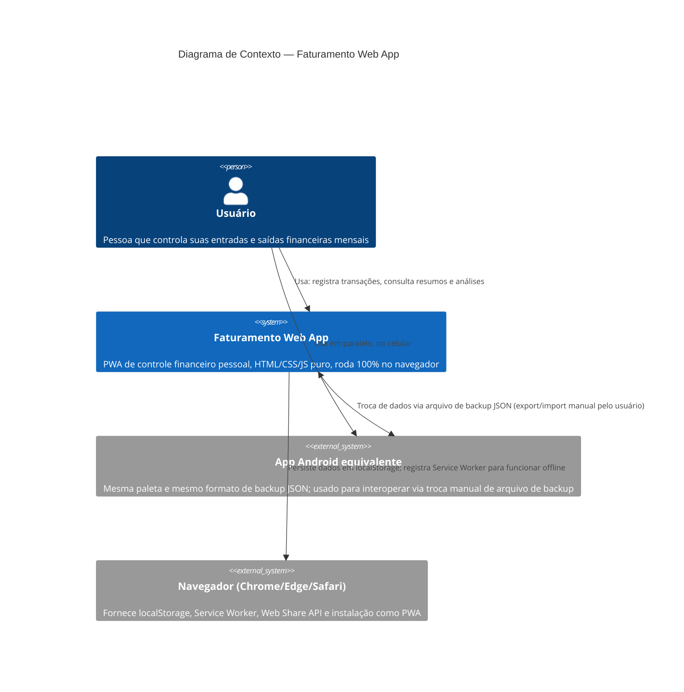
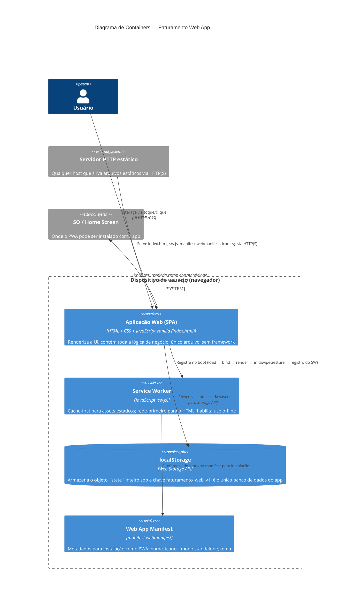
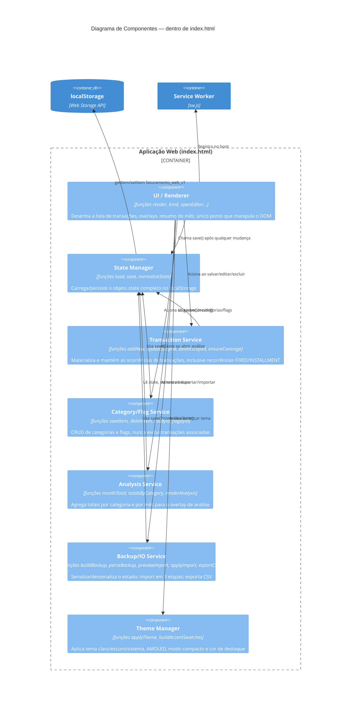

# Diagrama C4

Modelagem da arquitetura do sistema seguindo o modelo C4 (Contexto,
Containers, Componentes). Como o app não tem backend, os níveis 1 e 2
concentram a maior parte da informação relevante; o nível 3 detalha os
módulos internos do container único (o navegador).

## Nível 1 — Diagrama de Contexto

## Nível 2 — Diagrama de Containers

> Não há "containers" no sentido de servidores/serviços separados: é um site
> estático servido por qualquer servidor HTTP, sem API própria. O diagrama
> mostra os artefatos que rodam no dispositivo do usuário.

## Nível 3 — Diagrama de Componentes (dentro da SPA)

