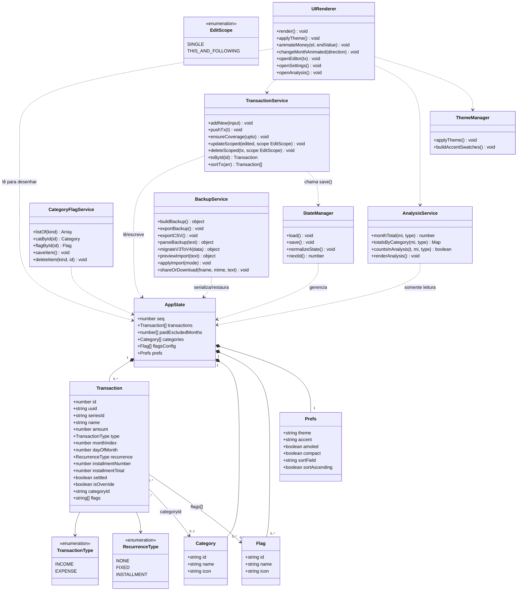

# Diagrama de Classes

> O app é escrito em JavaScript vanilla, procedural, sem classes ES6 reais.
> Este diagrama documenta o **modelo de dados** (as estruturas persistidas em
> `state`, salvas em `localStorage`) e os **módulos funcionais** do único
> arquivo `index.html`, tratados como classes lógicas para fins de
> documentação de arquitetura.

## Modelo de dados e serviços

## Notas

- **`Category` e `Flag`** são conceitos distintos: uma `Category` por
  `Transaction` (classificação única), N `Flag`s por `Transaction`
  (marcadores livres).
- **`seriesId`** liga as ocorrências materializadas de uma mesma recorrência
  (`FIXED` ou `INSTALLMENT`); `EditScope` define se uma edição/exclusão afeta
  só a ocorrência (`SINGLE`) ou ela e as futuras da mesma série
  (`THIS_AND_FOLLOWING`).
- **`uuid`** é a chave de deduplicação usada por `BackupService` ao importar
  (`MERGE`); **`id`** é apenas o identificador interno incremental.
