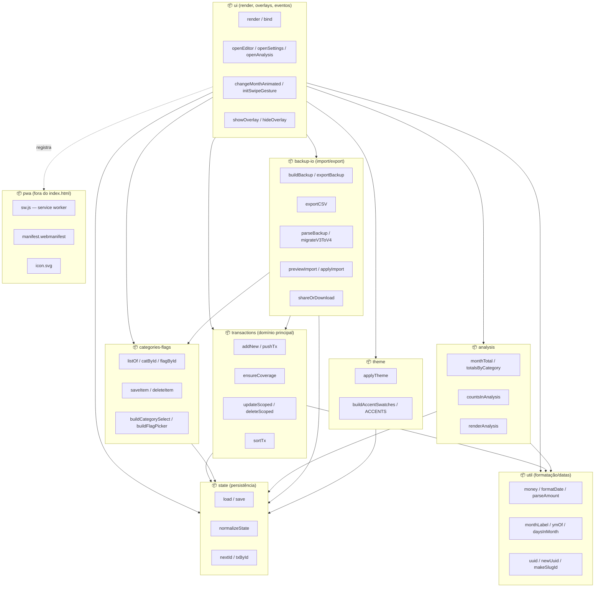
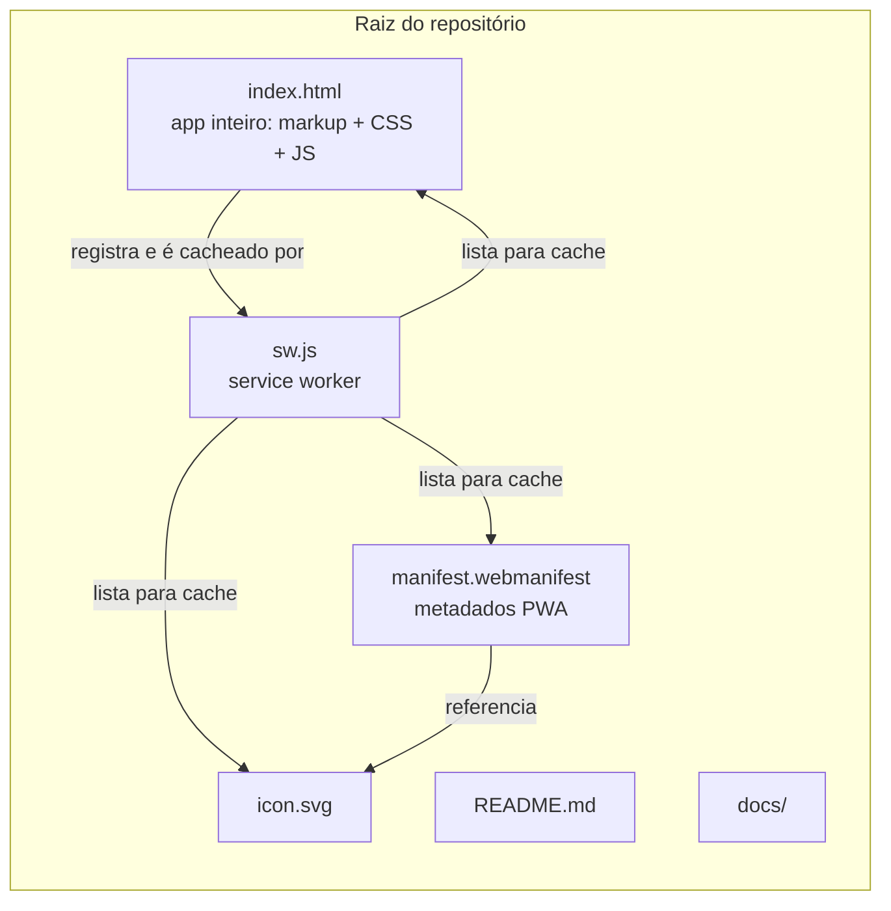

# Diagrama de Implementação de Pacotes

> O projeto não tem build nem módulos ES (`import`/`export`) — tudo vive num
> único `<script>` dentro de `index.html`. Os "pacotes" abaixo são
> **agrupamentos lógicos de responsabilidade** dentro desse arquivo, mais os
> artefatos físicos do repositório (`sw.js`, `manifest.webmanifest`,
> `icon.svg`). O diagrama mostra as dependências reais entre esses
> agrupamentos.

## Pacotes lógicos (dentro de `index.html`)

## Pacotes físicos (repositório)

## Regras de dependência

- **`ui`** é o único pacote que conhece todos os outros — orquestra tudo a
  partir de `render()` e dos handlers registrados em `bind()`.
- **`analysis`**, **`categories-flags`** e **`backup-io`** só leem/escrevem
  `state` diretamente, nunca manipulam o DOM sozinhos (quem desenha é sempre
  `ui`).
- **`util`** não depende de nenhum outro pacote — é a camada mais baixa
  (formatação de moeda, datas, geração de ids).
- **`pwa`** é independente do domínio de negócio: só faz cache de arquivos
  estáticos, não conhece `Transaction`, `Category` etc.
- Não há dependência de pacotes externos (sem `package.json`, sem CDN) — é
  100% vanilla.
