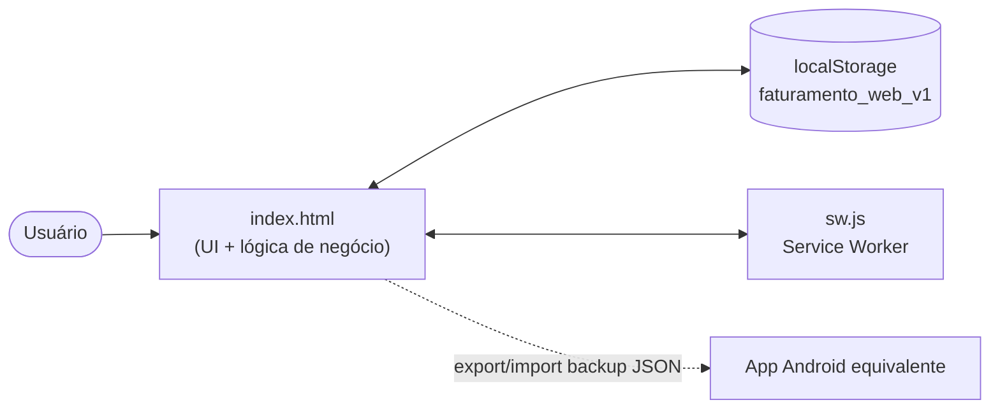

# Handoff do Projeto — Faturamento Web App

> Documento de transferência de conhecimento. Objetivo: alguém que nunca viu
> o projeto conseguir rodar, entender, alterar e publicar mudanças sem
> precisar perguntar nada a quem escreveu isto.

**Data do handoff:** 24/08/2026
**Repositório:** https://github.com/Matheus-Emanoel-Souza/FaturamentoAnalyticsWebApp
**Produção:** https://matheus-emanoel-souza.github.io/FaturamentoAnalyticsWebApp/
**Branch principal:** `main` (sem outras branches ativas)
**Status atual:** estável, working tree limpo, sincronizado com `origin/main` no commit `1880e7d`.

---

## 1. O que é o projeto

App de **controle financeiro pessoal** (entradas e saídas por mês), em
português-BR, que roda inteiramente no navegador — sem backend, sem
cadastro, sem servidor. É um **fork** de
[lucasmarx10/FaturamentoWebApp](https://github.com/lucasmarx10/FaturamentoWebApp),
mantido como a versão web/PWA de um **app Android equivalente já existente**,
compartilhando a mesma paleta de cores e o mesmo formato de backup JSON para
que os dois interoperem (usuário exporta de um, importa no outro).

A filosofia do fork é **evoluir pontualmente sem reescrever**: continua HTML
+ CSS + JS puro, um arquivo só, sem framework, sem build, sem
`package.json`.

## 2. Como rodar

Não há instalação de dependências — não existe `npm install` nem nada
parecido. Só precisa de um servidor HTTP estático porque o service worker
não funciona em `file://`:

```bash
git clone https://github.com/Matheus-Emanoel-Souza/FaturamentoAnalyticsWebApp
cd FaturamentoAnalyticsWebApp
python -m http.server 8000
# abrir http://localhost:8000
```

Qualquer outro servidor estático serve (`npx serve`, extensão Live Server do
VS Code, etc.). **Não há testes automatizados, lint, nem build** — a única
forma de verificar uma mudança é abrir no navegador e testar manualmente.

## 3. Estrutura de arquivos

```
FaturamentoAnalyticsWebApp/
├── index.html              # o app inteiro (~1.345 linhas): markup + CSS + JS
├── sw.js                   # service worker (cache "faturamento-v5")
├── manifest.webmanifest    # metadados PWA
├── icon.svg                # ícone do app
├── README.md                # apresentação pública / pitch do fork
├── CLAUDE.md                 # contexto de arquitetura para agentes de IA
└── docs/                    # documentação de arquitetura (adicionada nesta sessão)
    ├── diagrama-de-classes.md
    ├── diagrama-de-pacotes.md
    ├── manual-de-atividades.md
    ├── caso-de-uso.md
    ├── diagrama-c4.md
    └── handoff.md            # este arquivo
```

**Comece por `CLAUDE.md`** — é o documento de arquitetura mais denso e
atualizado do projeto (modelo de dados, fluxo de execução, convenções). Os
diagramas em `docs/` são a mesma informação em formato visual (Mermaid),
pensados para quem prefere ler diagrama a prosa.

## 4. Arquitetura em uma imagem



- **Estado único**: tudo vive num objeto `state` global, salvo inteiro no
  `localStorage` a cada `save()`.
- **Sem API, sem rede**: a única "rede" é o Service Worker cacheando os
  próprios arquivos estáticos para funcionar offline.
- **Fluxo de renderização**: `load()` → `bind()` → `render()` →
  `initSwipeGesture()` → registra SW. `render()` é o único ponto de desenho;
  todo handler que muda dado chama `save()` e depois `render()`.

Detalhes completos do modelo de dados, recorrências, escopo de
edição/exclusão e regras de negócio: ver `CLAUDE.md` (seção "Modelo de
dados" e "Conceitos centrais").

## 5. Convenções que **precisam** ser respeitadas

| Regra | Por quê |
|---|---|
| Bumpar a versão do cache em `sw.js` (hoje `faturamento-v5`) sempre que mudar `sw.js` ou os assets | Senão o navegador continua servindo a versão antiga em cache |
| Manter `ACCENTS` e o schema de backup em sincronia com o app Android | É o contrato de interoperabilidade entre os dois apps |
| `DEFAULT_CATEGORIES` / `DEFAULT_FLAGS` só populam quando a chave **não existe** | Array vazio é uma escolha do usuário (apagou tudo), não deve ser repovoado |
| Excluir categoria/flag nunca exclui transações | Só desvincula (`categoryId = null` / remove da lista `flags`) |
| Recorrência (`FIXED`/`INSTALLMENT`) só é definida na criação, nunca na edição | O bloco de recorrência (`recWrap`) fica escondido ao editar |
| Toda mudança de dado passa por `save()` seguido de `render()` | É o único jeito de manter UI e `localStorage` consistentes |
| Gráficos de análise: **rosca/pizza só quando representa distribuição percentual de um total** (hoje, só "Gastos por categoria" no Dashboard); fora disso, sem rosca/pizza, uma cor só por barra/linha, delta sempre com ▲/▼ junto do número | Guia interno de dataviz do projeto — ver seção "Dashboard" no `CLAUDE.md` |

## 6. Estado do repositório neste momento

- `git status` limpo, sem staged/unstaged changes.
- Sincronizado com `origin/main`.
- Últimos 3 commits:
  - `1880e7d` docs: adiciona README
  - `0275bc5` feat: análise por categoria
  - `5125b39` feat: categorias, flags, backup v4 e exportação CSV
- **Pendente de commit**: os 6 arquivos novos em `docs/` criados nesta
  sessão ainda não foram commitados (foram só gravados em disco).

## 7. O que falta / próximos passos sugeridos

Não há backlog formal (sem issues abertas, sem TODO no código). Sugestões
com base no que existe hoje:

1. **Commitar `docs/`** — os diagramas de arquitetura gerados nesta sessão
   ainda estão fora do controle de versão.
2. **Nenhuma cobertura de teste** — se o projeto crescer, vale considerar
   testes manuais roteirizados (checklist) já que não há framework de teste
   no stack.
3. **Sincronização entre dispositivos** é manual (export/import de backup);
   não há qualquer forma de sync automático — é uma decisão de design
   (privacidade / sem servidor), não uma lacuna a resolver sem discutir com
   o dono do produto antes.
4. **Deploy** é via GitHub Pages a partir de `main` — qualquer merge nessa
   branch vai para produção; não há ambiente de staging.

## 8. Riscos / pontos de atenção para quem for mexer

- **Arquivo único de ~1.345 linhas**: fácil de gerar conflito de merge se
  duas pessoas mexerem em partes diferentes do mesmo arquivo ao mesmo tempo.
- **`normalizeState()`** é o que garante compatibilidade com dados salvos
  por versões antigas — qualquer mudança no schema de `state` deve prever
  migração ali, nunca assumir que o dado já vem no formato novo.
- **Compatibilidade com o app Android**: mudanças no formato de backup
  (`buildBackup`/`parseBackup`) quebram a interoperabilidade se não forem
  espelhadas do outro lado. Confirme com quem mantém o app Android antes de
  alterar o schema v4.
- **Sem CI**: nada barra um commit quebrado. Testar manualmente antes de
  fazer push para `main`, já que é direto para produção.

## 9. Referências

- Contexto de arquitetura para IA: `CLAUDE.md` (raiz do projeto)
- Diagramas de arquitetura: `docs/diagrama-de-classes.md`,
  `docs/diagrama-de-pacotes.md`, `docs/manual-de-atividades.md`,
  `docs/caso-de-uso.md`, `docs/diagrama-c4.md`
- Projeto original (upstream): https://github.com/lucasmarx10/FaturamentoWebApp
- Apresentação pública / pitch: `README.md`
