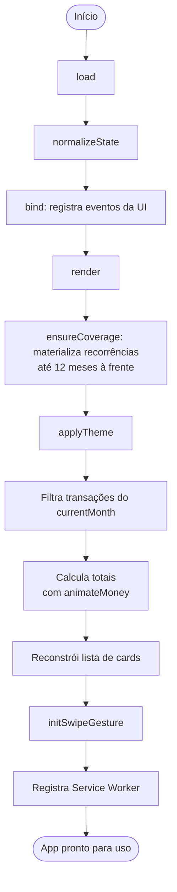
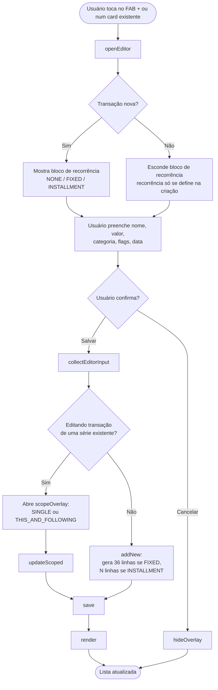
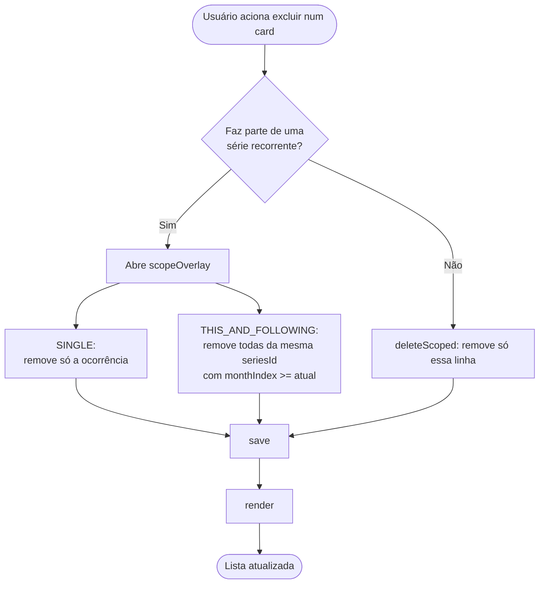
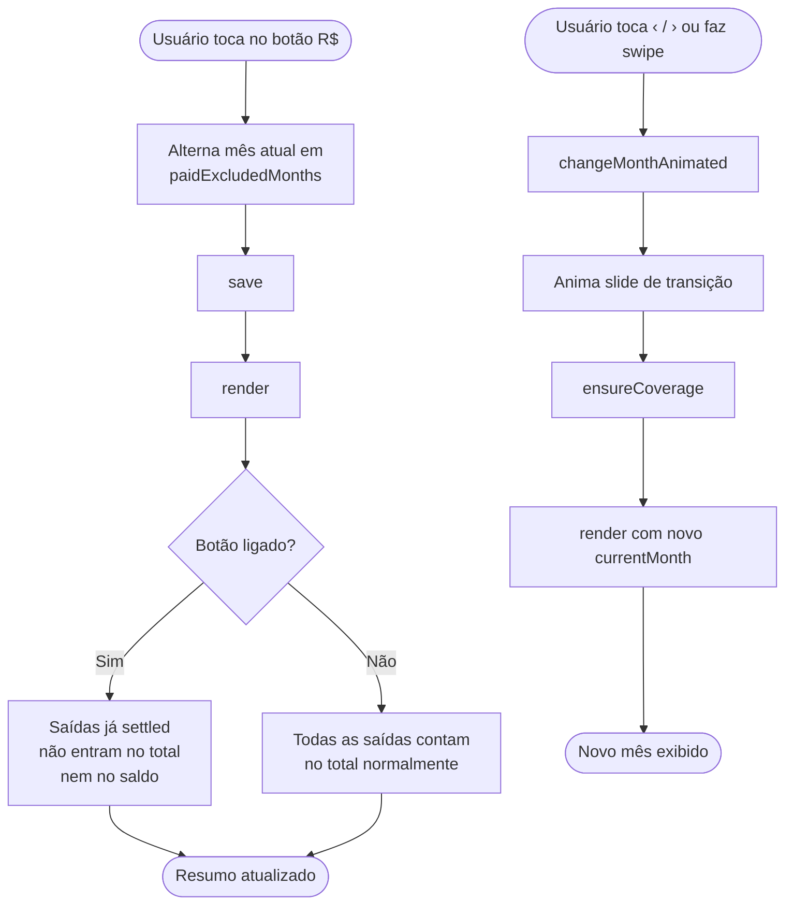
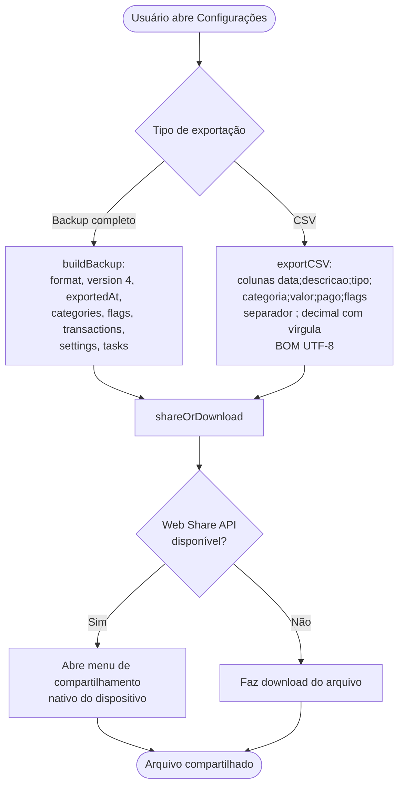

# Manual de Atividades (com Diagrama)

Guia de uso do app descrevendo os principais fluxos de atividade do usuário,
cada um acompanhado do diagrama de atividades correspondente (UML,
representado em Mermaid).

---

## 1. Inicialização do app

Ao abrir `index.html`, o app carrega o estado salvo, prepara a tela e
registra o service worker para funcionar offline.



---

## 2. Adicionar ou editar uma transação



---

## 3. Excluir uma transação



---

## 4. Alternar "descontar pagos" (botão R$) e navegar entre meses



---

## 5. Importar backup (3 etapas)

```mermaid
flowchart TD
    Start([Usuário escolhe arquivo de backup]) --> Preview[previewImport: parseBackup]
    Preview --> Version{version < 4?}
    Version -- Sim --> Migrate[migrateV3ToV4:\ngera uuid, flags: [],\ncategoryId: null]
    Version -- Não --> Summary
    Migrate --> Summary[Mostra resumo:\nversão, nº transações,\nperíodo, categorias, flags,\ntotais, quantas seriam novas]
    Summary --> Choice{Usuário escolhe modo}
    Choice -- REPLACE --> Replace[Apaga transações atuais\ne restaura o backup]
    Choice -- MERGE --> Merge[Adiciona sem apagar:\ndeduplica por uuid,\nmescla categorias/flags por id\nlocal prevalece,\npushTx reatribui id]
    Choice -- Cancelar --> Cancel[Nada é alterado]
    Replace --> Apply[applyImport]
    Merge --> Apply
    Apply --> Save[save]
    Save --> Render[render]
    Render --> End([Dados importados])
    Cancel --> End2([Overlay fechado, estado intacto])
```

---

## 6. Exportar dados (backup JSON v4 ou CSV)


